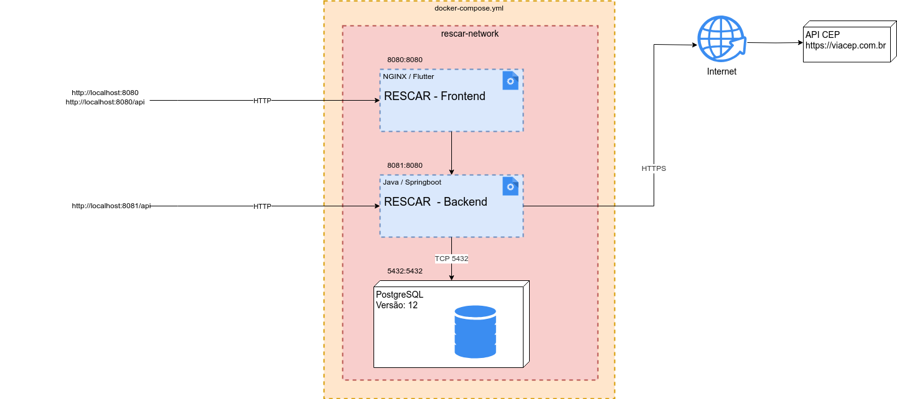
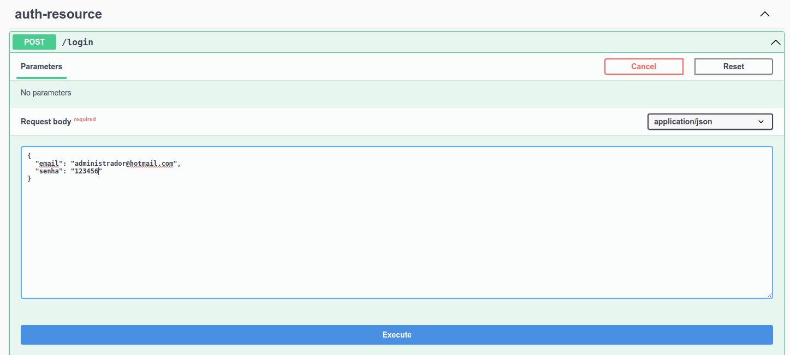
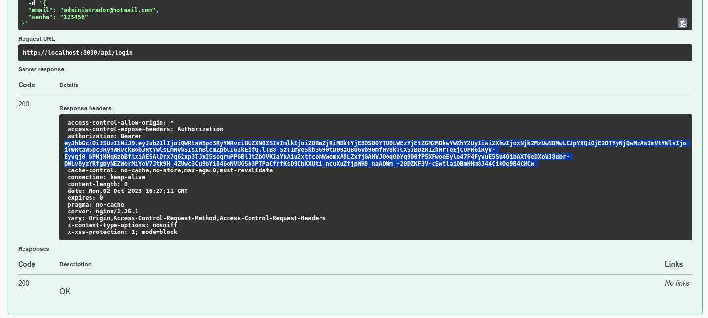
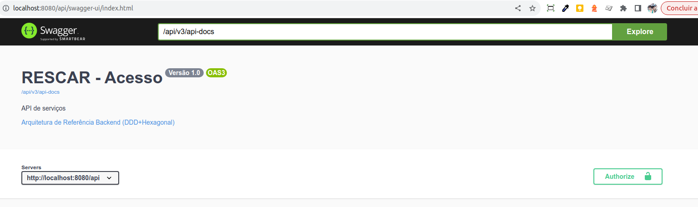
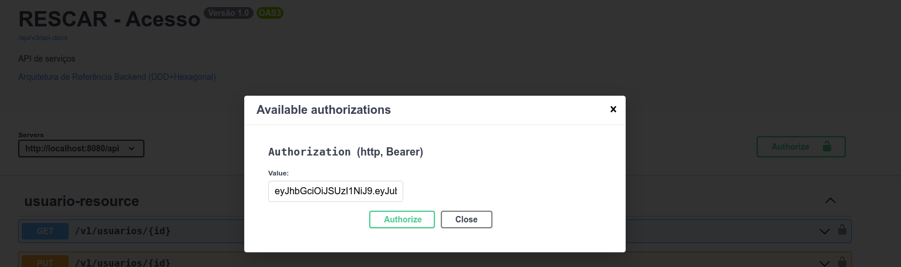
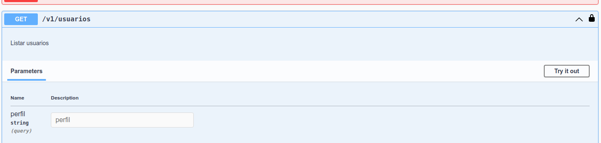
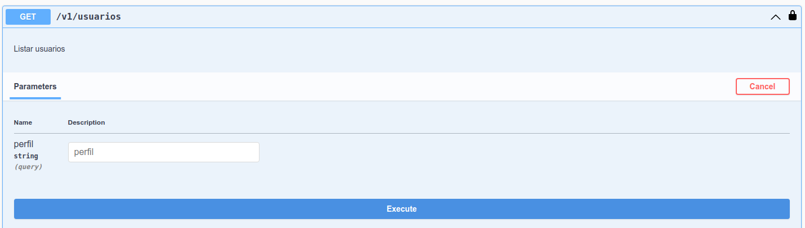
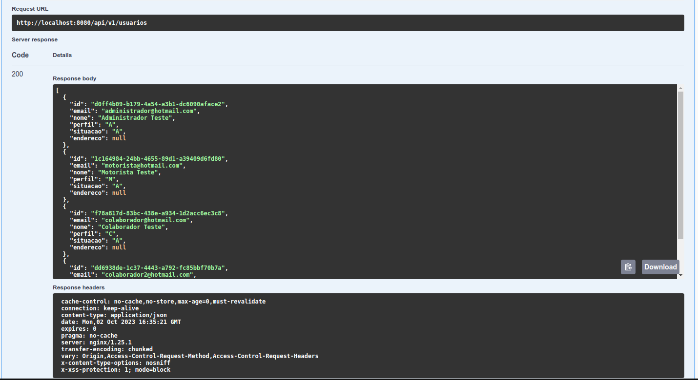

# Poc Api Managment

Poc para validação de ferramentas para Api Managment utilizando o **Rescar** como base.

## Rescar - Docker



[Download docker_rescar.zip](https://serprogovbr-my.sharepoint.com/:u:/g/personal/theo_pavan_serpro_gov_br/EWR6zHDcdAVHhzgahmNIZ1IBd8tkQxmrtTMM79vhnB0RKg?e=MNFKmb)

[Download opção google drive](https://drive.google.com/file/d/1sXEwAwhmYhoB1E6LwtpVfZTLMtaw3x6N/view?usp=sharing)

``` bash
# extrair o conteúdo da pasta docker_rescar.zip
> cd docker_rescar
> docker-compose up
```

Frontend Rescar - Docker: [http://localhost:8080](http://localhost:8080)

Swagger Rescar - Docker: [http://localhost:8080/api/swagger-ui/index.html](http://localhost:8080/api/swagger-ui/index.html)

## Usuários de Teste

| Usuário                       | Senha                 |
| ----------------------------- | --------------------- |
| administrador@hotmail.com     | 123456                |
| colaborador@hotmail.com       | 123456                |
| motorista@hotmail.com         | 123456                |

### Usando o Swagger

- Primeiro efetuar o login utilizando o serviço ***/login***



    - Clicar em **Try it out**
    - Preencher o **Request body** com email/senha
    - Clicar em **Execute**

- Copiar o token presente no cabeçalho **authorization** da resposta, sem o **Barear**



- Clicar na opção **Authorize** (no topo da página, ao lado de *Servers*)



- Adicionar o token copiado na opção *Value* e clicar em **Authorize**



- Executar as demais funcionalidades que exigem login, por exemplo o serviço **Listar Usuários** *GET /v1/usuarios*





    - Clicar em **Try it out**
    - Clicar em **Execute**



## Desenvolvimento local

Alguns comandos úteis no desenvolvimento local:

``` bash
# build/atualização da versão rodando no docker local
> ./build-rescar-docker.sh

# build/deploy do Frontend para o Estaleiro
> ./estaleiro/frontend/deploy.sh

# build/deploy do Backend para o Estaleiro
> ./estaleiro/backend/deploy.sh

# build flutter web
> cd ./frontend/rescar
> flutter build web

# executar flutter web em desenvolvimento
> cd ./frontend/rescar
> flutter run -d chrome
```

- *[DICA] Desenvolvimento Frontend x Backend LOCAL*
    
    Se for executar o *frontend* e/ou *backend* localmente sem o auxílio do docker, verificar o arquivo *./frontend/rescar/lib/utils/chopper_clients.dart* se o **baseUrl** está apontando para o *backend* correto. O padrão é ***/api*** para acesso no *estaleiro* e quando executando backend e frontend via *docker*. 
    
    Por exemplo, para o desenvolvimento local executando o frontend manualmente e acessando o backend no docker seria ***baseUrl = http://localhost:8081***.


## Rescar - Docker com Banco Externo
Segue o procedimento para subir o Rescar em uma VM e o banco em uma instância externa.

Baixar o dump do banco testes e rodar o script abaixo.
[Download dump database google drive](https://drive.google.com/file/d/1Ryjm8ky1ou7_jpum5vpOKreX52-oFbsh/view?usp=drive_link)

Apos rodar o dump do do banco, deve ser configurad o acesso externo para a base

Baixar o docker, e editar o docker-compose.yml. Alterar os valores dos campos:  DATASOURCE_URL; DATASOURCE_USERNAME; DATASOURCE_PASSWORD

[Download Docker google drive](https://drive.google.com/file/d/1Ryjm8ky1ou7_jpum5vpOKreX52-oFbsh/view?usp=drive_link)


``` bash
# extrair o conteúdo da pasta docker_rescar.zip
> cd docker_rescar
> docker-compose up
```
