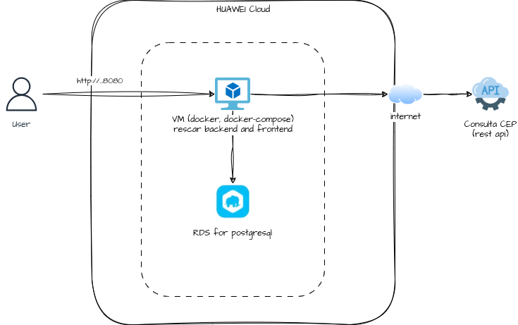

# Poc Api Managment

Poc para validação de ferramentas para Api Managment utilizando o **Rescar** como base.

## Cenários

* [Rescar Docker (VM only)](#rescar---docker)
* [Rescar Docker (VM + RDS)](#rescar---docker-com-banco-externo)


## Rescar - Docker


### Requisitos

* Máquina Virtual
  * Linux
  * Docker + Docker Compose
* Egress Policy:
  * https://viacep.com.br/ws/%s/json

### Downloads


Opção 1:

[Download opção google drive](https://drive.google.com/file/d/1sXEwAwhmYhoB1E6LwtpVfZTLMtaw3x6N/view?usp=sharing) - https://drive.google.com/file/d/1sXEwAwhmYhoB1E6LwtpVfZTLMtaw3x6N/view?usp=sharing

Opção 2:

[Download docker_rescar.zip](https://serprogovbr-my.sharepoint.com/:u:/g/personal/theo_pavan_serpro_gov_br/EWR6zHDcdAVHhzgahmNIZ1IBd8tkQxmrtTMM79vhnB0RKg?e=MNFKmb)

``` bash
# extrair o conteúdo da pasta docker_rescar.zip
> cd docker_rescar
> docker-compose up
```

Frontend Rescar - Docker: [http://localhost:8080](http://localhost:8080)

Swagger Rescar - Docker: [http://localhost:8080/api/swagger-ui/index.html](http://localhost:8080/api/swagger-ui/index.html)

## Usuários de Teste

| Usuário                       | Senha                 |
| ----------------------------- | --------------------- |
| administrador@hotmail.com     | 123456                |
| colaborador@hotmail.com       | 123456                |
| motorista@hotmail.com         | 123456                |

[Testes usando a API via Swagger](swagger.md)


## Rescar - Docker com Banco Externo




Segue o procedimento para subir o Rescar em uma VM com banco em uma instância externa/separada.

1) Baixar o dump do banco testes e rodar o script abaixo.
[Download dump database google drive](https://drive.google.com/file/d/1PQ2-X-90VoyE43v3tBHprkR3_Vc_O4Vl/view?usp=drive_link)

2) Apos rodar o dump do do banco, deve ser configurad o acesso externo para a base

3) Baixar o docker, e editar o docker-compose.yml. Alterar os valores dos campos:  DATASOURCE_URL; DATASOURCE_USERNAME; DATASOURCE_PASSWORD
[Download Docker google drive](https://drive.google.com/file/d/1Ryjm8ky1ou7_jpum5vpOKreX52-oFbsh/view?usp=drive_link)

4) Extrair o conteúdo da pasta docker_rescar.zip
``` bash
> cd docker_rescar_dbms
> docker-compose up
```
