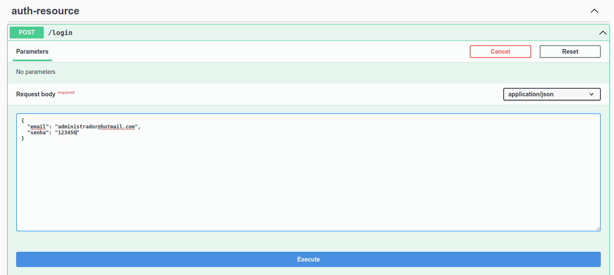

### Usando o Swagger

- Primeiro efetuar o login utilizando o serviço ***/login***

    - Clicar em **Try it out**
    - Preencher o **Request body** com email/senha
    - Clicar em **Execute**

- Copiar o token presente no cabeçalho **authorization** da resposta, sem o **Barear**

- Clicar na opção **Authorize** (no topo da página, ao lado de *Servers*)

- Adicionar o token copiado na opção *Value* e clicar em **Authorize**

- Executar as demais funcionalidades que exigem login, por exemplo o serviço **Listar Usuários** *GET /v1/usuarios*

    - Clicar em **Try it out**
    - Clicar em **Execute**

